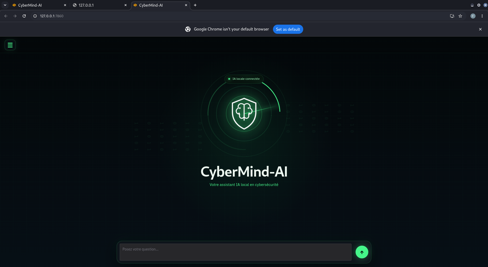

# 🛡️ CyberMind AI

> **⚠️ Project Status:** This project is currently under active development. New features, improvements and optimizations are continuously being added.

CyberMind AI is a local artificial intelligence assistant designed for Linux and defensive cybersecurity.

The goal of this project is to build a modern AI assistant capable of running entirely on a local machine using Ollama and open-source language models, without relying on external cloud AI services.

The application combines artificial intelligence, Linux, Python and cybersecurity into a single desktop assistant focused on learning, system administration and defensive security.

---

## 🚧 Development Status

CyberMind AI is **still under development**.

The current version already includes:

- ✅ Local AI powered by Ollama
- ✅ Qwen 2.5 integration
- ✅ Modern web interface
- ✅ Persistent conversation history
- ✅ Conversation management
- ✅ Local configuration system
- ✅ Multiple model selection
- ✅ Dark and Light themes

Several advanced features are planned for future releases.

---

## 🎯 Project Goals

This project aims to demonstrate practical skills in:

- Artificial Intelligence
- Python Development
- Linux
- Cybersecurity
- REST APIs
- Software Architecture
- Git & GitHub

It is also part of my cybersecurity engineering portfolio.

---

## 📸 Preview

---

## ✨ Current Features

- Local AI assistant
- Ollama integration
- Qwen 2.5 models
- Modern cyber-inspired interface
- Persistent conversations
- Multiple conversation management
- Local configuration
- Dark / Light mode
- Responsive design
- 100% local execution

---

## 🚀 Planned Features

The following features are planned for future versions:

- PDF analysis
- Folder analysis
- File analysis
- Malware explanation
- Log analysis
- Report generation
- Streaming responses
- Better UI animations
- Plugin architecture
- RAG support
- Voice interaction
- Multi-language support

---

## ⚙️ Technologies

- Python
- Ollama
- Qwen 2.5
- Gradio
- HTML
- CSS
- JavaScript
- JSON
- Linux
